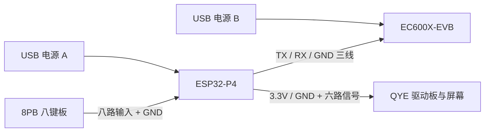

# 四月天：四板免焊接线方案

适用硬件：微雪 ESP32-P4-Module-DEV-KIT、移远 EC600X-EVB（EC600MCNLE）、奇耘 QYEG0420BNS830 及其八针驱动板、8 Push Buttons V1.02。规划日期：2026-09-10。

采用 **20 根杜邦线、两路 USB 供电**。ESP 管理串口通信、屏幕和八键输入；EC 使用板载开关机按键及音频接口。各模块通过已安装的排针连接，屏幕保持原配 FPC 与驱动板连接。GPIO 与针脚已按资料核验，实物上电验收见下文。

## 1. 定位 ESP 排针

面向元件面，将 **40 针排针置于右侧、C6 UART 接口在上、USB HOST/DEVICE 跳帽在下**。从上往下数 20 行，左列靠主控，右列靠板边。

官方原理图将该连接器命名为 **P6**，左列脚号为 2、4、…、40，右列为 1、3、…、39。下文 `P6-24` 表示连接器第 24 脚；`GPIO0` 表示芯片 GPIO。位置与丝印共同核对。

[官方引脚图](https://www.waveshare.com/w/upload/3/3b/ESP32-P4-Module-DEV-KIT-details-intro.jpg) · [完整 40 针表](../../.agents/skills/waveshare-esp32-p4-dev-kit/references/hardware-specs-and-pinout.md)

## 2. EC600X：3 根线

| 线号 | ESP 端 | ESP 位置 | EC 端 | 作用 |
| --- | --- | --- | --- | --- |
| E1 | GPIO0 / P6-24 | 第 12 行左 | J5-7 / RX0 | ESP TX → EC RX |
| E2 | GPIO1 / P6-21 | 第 11 行右 | J5-6 / TX0 | EC TX → ESP RX |
| E3 | GND / P6-26 | 第 13 行左 | J5-1 / GND | 公共信号地 |

J5 为 EC 板上的 18 针排针，按板上 J5 标识及 Pin 1 标记定位，J5-1、J5-2 为 GND，J5-6 为 TX0，J5-7 为 RX0。J5 与 J6 分别编号。

EC600X-EVB V3.2 原理图第 6 页确认 TXD0_3V3/RXD0_3V3 引出到 J5-6/J5-7。板载电平转换已提供 3.3V 接口；本方案连接 EVB 排针。

ESP 固件配置 **UART1：TX=GPIO0、RX=GPIO1**，通过 GPIO matrix 路由。主板 CH343P 调试使用 UART0 的 GPIO37/38。EC 的 TX0/RX0 对应 EC 端主串口。初始参数建议 115200、8N1、关闭硬件流控，波特率需与现有 modem 固件设置一致。

## 3. QYE 屏幕驱动板：8 根线

**用户于 2026-09-10 确认的驱动板针序，从左到右：**

```text
BUSY   RES   D/C   CS   SCK   SDI   GND   3.3V
  1     2     3    4     5     6     7      8
```

数字为本文从 BUSY 端开始的顺序号。以 BUSY 和 3.3V 两端丝印识别方向。

| 线号 | 屏幕顺序号 / 丝印 | ESP 端 | ESP 位置 | ESP 方向 / 作用 |
| --- | --- | --- | --- | --- |
| Q1 | 1 / BUSY | GPIO22 / P6-11 | 第 6 行右 | 输入，读取忙状态 |
| Q2 | 2 / RES | GPIO21 / P6-12 | 第 6 行左 | 输出，复位 |
| Q3 | 3 / D/C | GPIO6 / P6-16 | 第 8 行左 | 输出，命令/数据选择 |
| Q4 | 4 / CS | GPIO5 / P6-15 | 第 8 行右 | 输出，SPI 片选 |
| Q5 | 5 / SCK | GPIO2 / P6-22 | 第 11 行左 | 输出，SPI 时钟 |
| Q6 | 6 / SDI | GPIO3 / P6-20 | 第 10 行左 | 输出，SPI MOSI |
| Q7 | 7 / GND | GND / P6-19 | 第 10 行右 | 电源与信号地 |
| Q8 | 8 / 3.3V | 3V3 / P6-18 | 第 9 行左 | 3.3V 电源 |

SDI 表示屏幕数据输入，接 ESP MOSI。使用 SPI2、四线 SPI 写入模式，时钟从 **1 MHz、Mode 0、MSB first** 开始。CS 初始化为高，RES 释放态为高；按 SSD1683 语义，D/C 低为命令、高为数据，RES 低有效，BUSY 高为忙。驱动板 BUSY/RES 是否经过反相以及复位脉宽仍需结合板级资料和首次点亮核验，作为驱动配置保留。

驱动板的 3.3V 针接主板 3V3；屏幕与驱动板保持配套。面板标称刷新功耗不能用于推导峰值供电需求，首次刷新需检查 3.3V 是否稳定。原厂初始化、LUT、VCOM 与刷新时序采用本型号对应资料。

## 4. 8PB 八键板：9 根线

从标注 G 的一端开始，排针顺序为 **G / K8 / K7 / K6 / K5 / K4 / K3 / K2 / K1**。

| 线号 | 从 G 端数 | 按键板丝印 | 对应按键 | ESP 端 | ESP 位置 |
| --- | ---: | --- | --- | --- | --- |
| B1 | 1 | G | 公共地 | GND / P6-33 | 第 17 行右 |
| B2 | 2 | K8 | S8 | GPIO48 / P6-34 | 第 17 行左 |
| B3 | 3 | K7 | S7 | GPIO47 / P6-38 | 第 19 行左 |
| B4 | 4 | K6 | S6 | GPIO46 / P6-35 | 第 18 行右 |
| B5 | 5 | K5 | S5 | GPIO27 / P6-37 | 第 19 行右 |
| B6 | 6 | K4 | S4 | GPIO26 / P6-32 | 第 16 行左 |
| B7 | 7 | K3 | S3 | GPIO23 / P6-8 | 第 4 行左 |
| B8 | 8 | K2 | S2 | GPIO20 / P6-14 | 第 7 行左 |
| B9 | 9 | K1 | S1 | GPIO4 / P6-17 | 第 9 行右 |

八键板由按键将 Kx 与 G 接通。所有按键 GPIO 配置为 **输入、内部上拉、低电平按下**。建议每 5 ms 扫描，连续稳定 20 ms 后更新状态；消抖时间可在 10～30 ms 内调整。应用层按 S1～S8 暴露事件，对应 GPIO 数组为 `[4, 20, 23, 26, 27, 46, 47, 48]`。

## 5. 供电与连接方式



ESP 使用 Type-C UART 口供电及调试；EC 使用自身 USB 口，电源开关置于 USB 挡。建议使用质量可靠、单路额定 5V/2A 或以上的 USB 电源与短线，ESP 同时接入大功率外设时按总负载增加容量。该额定值为工程起点，最终供电能力以蜂窝发射和屏幕刷新同时运行时的测量为准。USB 电源 A/B 可来自有足够独立端口供电能力的同一适配器。

E3、Q7、B1 分别接 ESP 的三个 GND 脚，构成公共地。EC 的 J6 电源脚保持空置，两块板的 5V、3.3V 输出各自独立；EC J6-3 为 1.8V，J6-18 为 VBAT。屏幕使用表中 P6-18 的 3V3。

板载排针均为公针时，准备 **20 根母对母杜邦线**，推荐长度 10～15 cm，按 E/Q/B 线号贴标签；有母座的一端改用公头。排针与接插件应为已安装成品。板子平放固定，屏幕 FPC 保留自然弯曲余量。

面包板可作为 GND 汇流和按键外部上拉的扩展位置。本方案的三个外设各有独立 GND 连接，现有 20 根连接线即可实施。使用面包板时，板端母头、面包板端公头；公共地电源轨确认连续，分段电源轨使用公对公短线桥接。每根信号占用独立导通排，面包板正电源轨限接 ESP 3.3V。需要外部上拉时，可将八个 10 kΩ 直插电阻分别接在 K1～K8 与 3.3V 之间。

## 6. 板载功能与资源分配

16 个 GPIO 分别承担 UART 2 路、屏幕 6 路、按键 8 路，分配互不重复。

| 资源 | 本方案处理 |
| --- | --- |
| GPIO7/8，板载 I2C | 保留给板载设备与后续传感器 |
| GPIO9～13、GPIO53，音频 | 保留给 ESP 板载音频 |
| GPIO24/25，原生 USB 1.1 | 保留 USB 功能 |
| GPIO32/33，J9 扩展口及上拉 | 保留扩展用途 |
| GPIO34～38，启动配置与调试 | 保留板载连接 |
| GPIO39～44，MicroSD 总线 | 保留存储用途 |
| GPIO45，MicroSD 电源控制 | 保留板载控制 |
| GPIO54 | 留作后续扩展 |
| EC 开机 / 复位 | 操作板载 PWRKEY / RESET 按键 |
| VoLTE 音频 | EC 板载麦克风与功放路径；扬声器使用原配插接件或板载接线端子 |

EC 的 PWRKEY、RESET_N、MAIN_RI、PCM 在现有 J5/J6 排针范围外。免焊方案的电源开关操作由板载按键完成，来电与通话状态经 UART URC 获取。若原配扬声器尚未安装，按 EVB 功放接口标识接入匹配扬声器，两根扬声器线接功放输出的正/负端。

## 7. 装配与上电验收

1. 两板断电，按上述观察方向定位 P6。将 E1～E3、Q1～Q8、B1～B9 逐根接好，核对屏幕两端丝印、EC 的 J5 编号和八键板 G 端。
2. 插好 EC 的 SIM 与原配蜂窝天线，EC 电源置 USB 挡。先连接公共地，再接 USB 电源；带通信线时保持两板共同供电。拆装信号线在两板断电后进行。
3. ESP 启动后先初始化 CS 为高、RES 为释放态、八键为输入上拉，再启动 UART1 与 SPI2。按 EC 板载 PWRKEY 开机，等待启动完成。
4. 发送 `AT` 并确认 `OK`；查询 `AT+CPIN?`、`AT+CEREG?`、`AT+CSQ`。若收不到回应，按 E1/E2 表核对收发方向、波特率与 modem 固件模式。
5. 依次按 S1～S8，确认每次仅对应通道由高变低，松开恢复高；同时按多键检查独立输入和消抖。
6. 加载匹配屏幕的初始化序列，确认 BUSY 能在截止时间内释放；绘制全白、全黑、棋盘格和四角标记，核对方向、400×300 分辨率与整帧 15,000 字节。
7. 基本全刷通过后评估局刷、休眠唤醒和刷新失败恢复。局刷以有效旧帧为前提。
8. 运行蜂窝通信与屏幕刷新，观察复位、串口丢字和供电波动；VoLTE 验证按注册、拨号、音频、挂断顺序进行。

## 8. 依据与验证范围

- [ESP 硬件技能](../../.agents/skills/waveshare-esp32-p4-dev-kit/SKILL.md)：官方引脚图与 [原理图第 1 页](https://files.waveshare.com/wiki/ESP32-P4-Module-DEV-KIT/ESP32-P4-Module-DEV-KIT.pdf) 已于 2026-09-10 交叉核验，包含 P6、CH343P、USB、SD 电源和音频网络。
- [EC 硬件技能](../../.agents/skills/quectel-ec600x-evb/SKILL.md)：[V3.2 原理图第 6 页](https://developer.quectel.com/wp-content/uploads/2024/09/EC600X_EVB_V3.2-SCH.pdf) 已核验 J5 针序与 3.3V 转换网络。
- [QYE 屏幕技能](../../.agents/skills/qyeg0420bns830/SKILL.md)：驱动板八针顺序采用用户 2026-09-10 提供的实物定义。驱动板版本、BUSY/RES 板级极性、刷新峰值电流与初始化参数仍需补入实测/随货资料。原厂面板附件本次重试返回 HTTP 403。
- [8PB 技能](../../.agents/skills/8-push-buttons/SKILL.md)：使用项目商品图记录的 G/K8～K1 定义。

本文件交付接线设计与验收步骤；硬件连线、通电和功能测试由实物验收确认。
